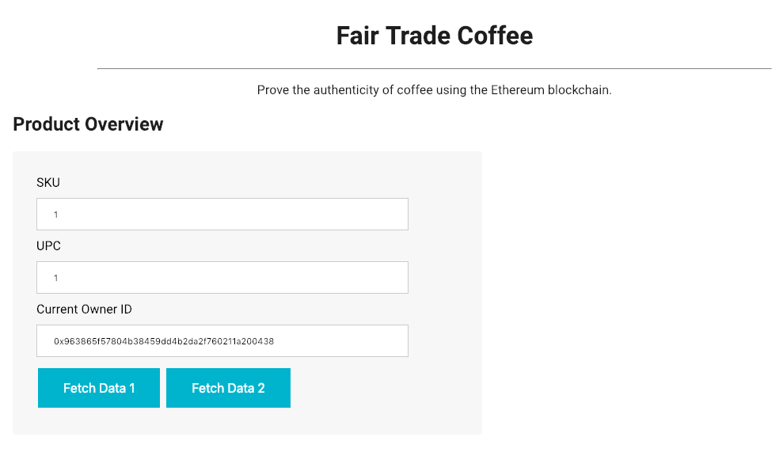
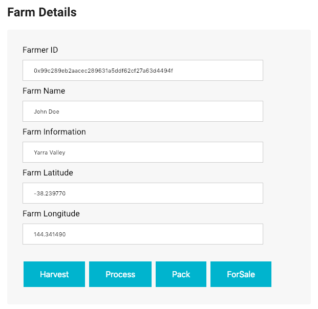
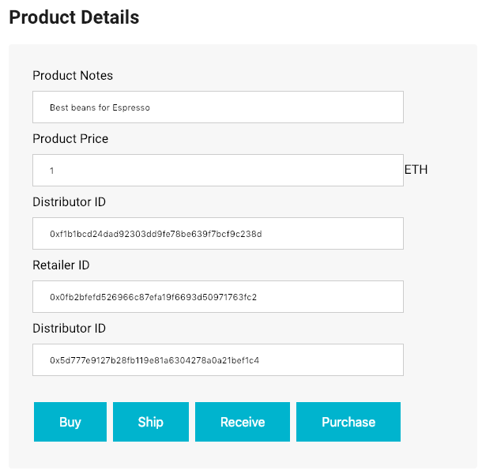
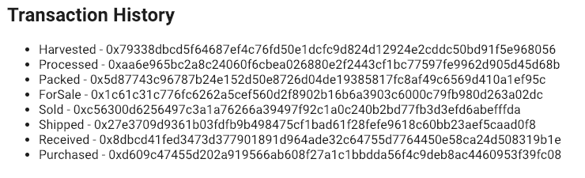

# Coffee Supply Chain

## Description
Ethereum DApp that demonstrates a Supply Chain flow between a Seller and Buyer. The user story is similar to any commonly used supply chain process. A Seller can add items to the inventory system stored in the blockchain. A Buyer can purchase such items from the inventory system. Additionally a Seller can mark an item as Shipped, and similarly a Buyer can mark an item as Received.

### Actors
* Farmer
* Distributor
* Retailer
* Consumer

### Actions
* **Farmer** – harvest coffee beans, process coffee beans, pack coffee bags, add coffee palettes, ship coffee palettes
* **Distributor** – buy coffee palettes
* **Retailer** – receive coffee palettes
* **Consumer** – buy coffee items 

Different steps that coffee beans goes through until it be bought by consumer showed in [activity diagram](#activity-diagram).

### User Interface

#### Product Overview Section
User can fetch information about concrete product.


#### Farm Details Section 
Farmer with concrete ID, Name, coordinates (Long and Lat), and some extra information can harvest coffee beans → process coffee beans → pack coffee bags → prepare them for sale.


#### Product Details Section
In this section prepared for sale coffee palettes can be bought by distributor. 
Then coffee palettes shiped by farmer to Retailer. Then Retailer received these palettes.
And finally Consumer bought Coffee items from Retailer.


#### Transaction History Section 
This section contains IDs of all transactions that was produced with concrete product.


## UML Diagrams

### Activity Diagram


### Sequence Diagram


### State Diagram


### Data Model Diagram


## Prerequisites

* Truffle v5.0.3 (core: 5.0.3)
* Solidity - ^0.4.25 (solc-js)
* Node v10.14.1

## How To Start
1. Clone this repository
2. Change directory to ```app``` folder and install all requisite npm packages:
```
cd app
npm install
```
3. Launch ganache:
```
npm run ganache 
```
4. In a separate terminal window, Compile smart contracts:
```
npm run compile 
```
5. Migrate smart contracts to the locally running blockchain, ganache-cli:
```
npm run migrate 
```
6. Test smart contracts:
```
npm run test 
```
7. In a separate terminal window, launch the DApp:
```
npm run dev
```

## Deployed contract (Rinkeby) 
* Transaction ID – 0x97cf866dc86c3dc444fdcc5b3bd47e1a74a76c8cb19fd397fff256b72ab30bbf 
* Contract ID – 0x467b6cc911d854c712c2c9e129eff5374e03094b

* https://rinkeby.etherscan.io/address/0x467b6cc911d854c712c2c9e129eff5374e03094b

### Transaction History 
* Harvested - 0x79338dbcd5f64687ef4c76fd50e1dcfc9d824d12924e2cddc50bd91f5e968056
* Processed - 0xaa6e965bc2a8c24060f6cbea026880e2f2443cf1bc77597fe9962d905d45d68b
* Packed - 0x5d87743c96787b24e152d50e8726d04de19385817fc8af49c6569d410a1ef95c
* ForSale - 0x1c61c31c776fc6262a5cef560d2f8902b16b6a3903c6000c79fb980d263a02dc
* Sold - 0xc56300d6256497c3a1a76266a39497f92c1a0c240b2bd77fb3d3efd6abefffda
* Shipped - 0x27e3709d9361b03fdfb9b498475cf1bad61f28fefe9618c60bb23aef5caad0f8
* Received - 0x8dbcd41fed3473d377901891d964ade32c64755d7764450e58ca24d508319b1e
* Purchased - 0xd609c47455d202a919566ab608f27a1c1bbdda56f4c9deb8ac4460953f39fc08

### License
[MIT](LICENSE)
